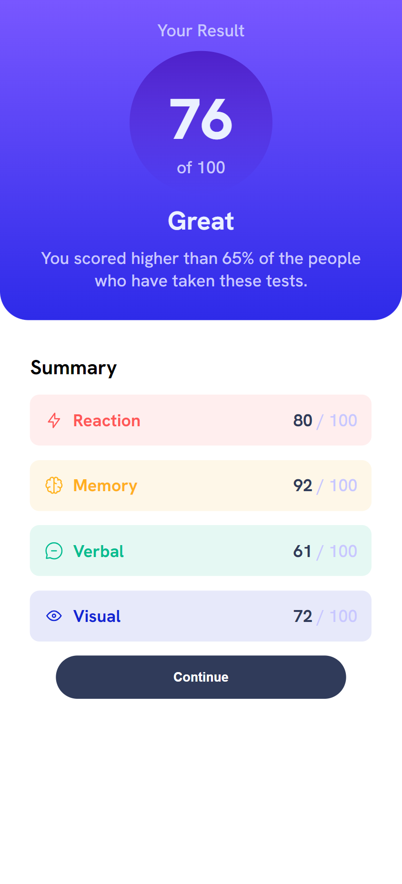

# Frontend Mentor - Results summary component solution

This is a solution to the [Results summary component challenge on Frontend Mentor](https://www.frontendmentor.io/challenges/results-summary-component-CE_K6s0maV). Frontend Mentor challenges help you improve your coding skills by building realistic projects. 

## Table of contents

- [Overview](#overview)
  - [The challenge](#the-challenge)
  - [Screenshot](#screenshot)
  - [Links](#links)
- [My process](#my-process)
  - [Built with](#built-with)
  - [Difficulties](#difficulties)
- [Author](#author)

## Overview

### The challenge

Users should be able to:

- View the optimal layout for the interface depending on their device's screen size
- See hover and focus states for all interactive elements on the page
- **Bonus**: Use the local JSON data to dynamically populate the content

### Screenshot

### Links

- Solution URL: (https://www.frontendmentor.io/solutions/results-summary-using-html-scss-jsjquery-and-json-QA7wYn95_y)
- Live Site URL: (https://omar-p-graham.github.io/results-summary/)

## My process

### Built with

- Semantic HTML5 markup
- Mobile-first workflow
- CSS custom properties
  - Flexbox
  - CSS Grid
- SASS/SCSS
  - BEM
- JavaScript
  - JQuery
  - JSON

### Difficulties

I was having a difficult time connecting the JSON file on GitHub. The connection between my JS file and the JSON file worked fine on my local machine via live server. However, the connection kept failing once the files were uploaded to GitHub.

On my local machine I used `../data.json` to locate the file from my JS file while on GitHub I had to use `./data.json`. I don't understand why. 

## Author

- Frontend Mentor - https://www.frontendmentor.io/profile/omar-p-graham
- LinkedIn - https://www.linkedin.com/in/omar-p-graham/